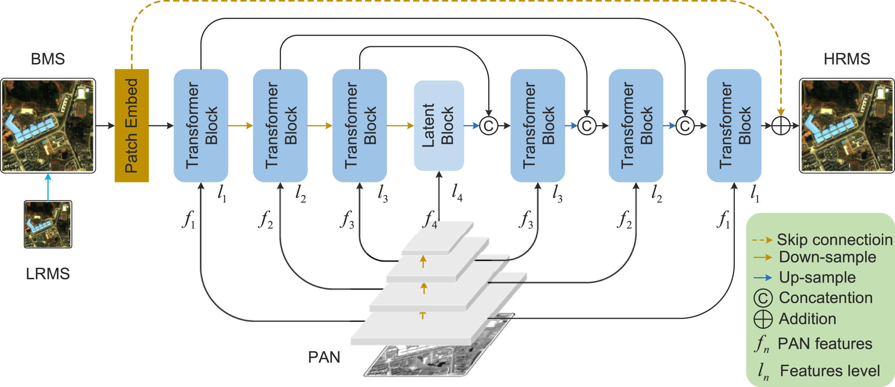

# Pan-Sharpening via Symmetric Multi-Scale Correction-Enhancement Transformers 

Official repository for [SMCET](https://doi.org/10.1016/j.neunet.2025.107226)  

  

## 📌 Introduction  
SMCET is a novel deep learning-based approach for pan-sharpening that enhances image quality through a **Symmetric Multi-Scale Correction-Enhancement Transformer (SMCET)** framework.  

### **Key Features:**  
- Uses a meticulous correction process before fusion to remove artifacts.  
- Captures self-similarity across scales to enhance texture details.  
- Achieves state-of-the-art performance in pan-sharpening tasks.  

## 🛠 Installation  
### **1. Clone the repository**  

```bash
git clone https://github.com/your-repo/SMCET.git
cd SMCET
```

### **2. Set up the environment**  
We recommend using **Python 3.8+** and setting up a virtual environment:  
```bash
conda create -n smcet python=3.8

```

### **3. Install dependencies**  
```bash
pip install -r requirements.txt
```

## 📂 Dataset  
SMCET requires paired **PAN** (panchromatic) and **MS** (multispectral) images.

You can download the dataset from Baidu Netdisk:
You can download the dataset from [Baidu Netdisk](https://pan.baidu.com/s/13UdyF5AoTllDJGDpFfBTvw?pwd=36y6).

After downloading, organize the dataset as follows: 
```
datasets/
│── train/
│   ├── PAN/    # Panchromatic images
│   ├── MS/     # Multispectral images
│── test/
│   ├── PAN/
│   ├── MS/
```
You can use public pan-sharpening datasets such as **IKONOS, QuickBird, WorldView-2 or WorldView-4**.

## 🚀 Usage  
### **1. Train the model**  
Run the following command to train SMCET:  
```bash
python main.py --option_path yml/SMCET.yml
```  

### **2. Test the model**  
```bash
python main.py --option_path yml/SMCET_test.yml
```

### **3. Run using the script**  
Alternatively, you can execute training or testing using:  
```bash
bash main.sh
```


For detailed evaluation results, refer to our paper.

## 📖 Citation  
If you find this repository useful, please cite our paper:  

```bibtex
@article{LI2025107226,
  title     = {Pan-sharpening via Symmetric Multi-Scale Correction-Enhancement Transformers},
  journal   = {Neural Networks},
  pages     = {107226},
  year      = {2025},
  issn      = {0893-6080},
  doi       = {https://doi.org/10.1016/j.neunet.2025.107226},
  url       = {https://www.sciencedirect.com/science/article/pii/S0893608025001054},
  author    = {Yong Li and Yi Wang and Shuai Shi and Jiaming Wang and Ruiyang Wang and Mengqian Lu and Fan Zhang}
}
```

## 📬 Contact  
For any questions or issues, feel free to open an issue or contact us.
